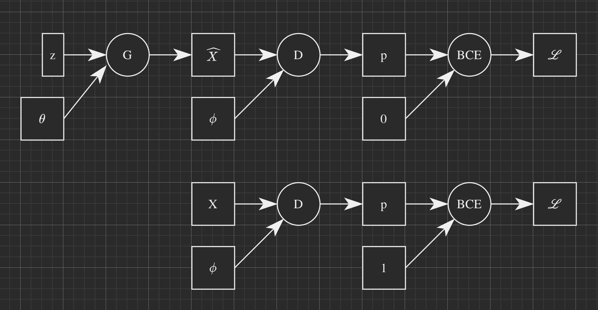
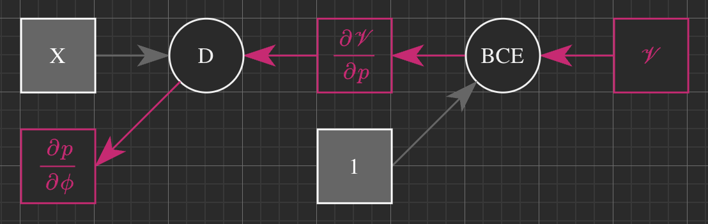
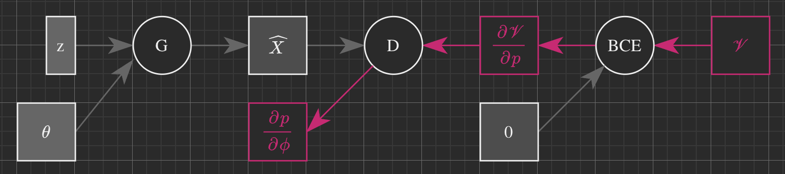

# Generative Adversial Networks

## General Approach

I’ll eschew the usual art counterfeiter and art critic analogy here, it has been done to death elsewhere. The main objective of a computer vision generator model ($G$) is to take a 1-D noise vector and convert it into a multidimensional tensor of a photo. In order to train it to generate good photos, we take the help of another discriminator model ($D$) whose job is to classify a given photo as “fake”, i.e., generated by the GAN model, or “real”, i.e., not generated. In the original paper, $D$ was given natural photos labeled as $1$ and generated photos labeled as $0$. Here is what the forward prop compute graphs looks like in this case -



In the first compute graph $z$ is the initial noise vector that is given to the generator model $G$ which has parameters $\theta$. It outputs a generated image $\hat X$ that is then fed into the discriminator model $D$ which has parameters $\phi$. This outputs a probability. By convention this is taken as the probability that the generated image is real, i.e., $p = P(1 \vert \hat X)$. This probability is fed to the BCE loss function along with a label of $0$, which says that the image is fake. The loss function outputs the loss value.

In the second compute graph, a real image $X$ is fed to $D$ which again outputs the probability that the image is real, i.e., $p = P(1 \vert X)$. This probability along with the label $1$ is fed to the BCE loss function which outputs the loss value.

Intuitively it can be seen that in the first compute graph, $D$ will try to classify the generated images as negative, $0$ and $G$ will try to generate images that $D$ will classify as positive $1$. So the ~~loss~~ objective function will have to be minimized when updating the parameters of one and maximized when updating the parameters of the other. In the second graph, there are only positive examples that $D$ will learn to classify as positive. 

## GAN Objective Function

From the discussion on BCE Loss functions we know that -
$$
J_{\theta} = \frac{1}{m} \left( \sum_i^{\color{lightgreen}{m_+}} -log(N_{\theta}( {\color{lightgreen}\mathbf x_i} ) ) + \sum_i^{ {\color{red}m_-} } -log(1 - N_{\theta}( {\color{red}\mathbf x_i} )) \right)
$$
where $\color{lightgreen}m_{+}$ is the number of positive examples and $\color{red}m_-$ is the number of negative examples in my dataset. Now if my model is super accurate, $\hat p_{\theta}(y \vert \mathbf x) \approx 1$, which means that $N_{\theta}( {\color{lightgreen}\mathbf x_i} ) \approx 1$ and $N_{\theta}( {\color{red}\mathbf x_i} ) \approx 0$ so that $(1 - N_{\theta}( {\color{red}\mathbf x_i} )) \approx 1$ and the cost will be driven down to $0$.
$$
\theta = argmin_{\theta}\;J_{\theta}
$$

Lets look at the backdrop of second compute graph with real images first as it is easier to reason about. Remember that $D_\phi(X) = p = P(1 \vert X)$, i.e., $D$ outputs the probability that its input is the real image. 


$$
J_{\phi} = \sum_i - log \; D_{\phi}( {\color{lightgreen} X_i} ) \\
\phi = argmin_{\phi} \; J_{\phi}
$$
Now lets look at the back prop when fake images are provided, but from learning about $\phi$, i.e., $D$‘s parameters. Here $D$ needs to get good at identifying the fake images, which means that $P(0 \vert \hat X)$ needs to be high, i.e., we need to find $\phi$ that will minimize the negative log of $1 - D_{\phi}({\color{red} \hat X})$ so that $D$ will get increasingly better at classifying fake image as fake.


$$
J_{\phi} = \sum_i -log \; (1 - D_{\phi}({\color{red} \hat X_i})) \\
\phi = argmin_{\phi} \; J_{\phi}
$$
Putting these two objective functions together and dropping the superscript $(i)$ for clarity we get -
$$
J_{\phi} = \sum -log \; D_{\phi}({\color{lightgreen} X}) + \sum -log \; (1 - D_{\phi}({\color{red} \hat X})) \\
\phi = argmin_{\phi} J_{\phi}
$$
So far there is nothing new here, this is the same old BCE loss function that we know and love. The only thing different is the way we present the negative and positive instances. In traditional binary classification problems, positive and negative instances are mixed up in a single mini-batch. Here we give the model all the positive examples first (the real images) and all the negative examples next (the generated images).

Now lets look at how to learn the parameters of $G$. It needs $D$ to classify fake images as real, which means that $P(1 \vert {\color{red}\hat X})$ needs to be high. Now remember that if $X$ is a positive example I need to minimize $-log(D_{\phi}(X))$ and if $X$ is a negative example I need to minimize $-log(1 - D_{\phi}(X))$. In the case of $G$, ${\color{red} \hat X}$ is a generated example that has a **positive** label, so I need to minimize $-log(D_{\phi}({\color{red} \hat X}))$.  Of course in this case I want to learn $G$ while keeping $D$ constant, so my objective function will be -
$$
J_{\theta} = \sum -log(D_{\phi}({\color{red} G_{\theta}(z)})) \\
\theta = argmin_{\theta} J_{\theta}
$$
In my actual implementation I minimize these two separate cost functions - $J_{\phi}$ and $J_{\theta}$. 

However, in the original paper, the formulation is a bit different. I am writing it here for information purposes, I don't think anybody uses the original formulation anymore. My main goal is to push $D_{\phi}({\color{red} G_{\theta}(z)}) \to 1$ and that is acheived by minimizing its negative log. But I can also get to the same goal by pushing $(1 - D_{\phi}({\color{red} G_{\theta}(z)})) \to 0$. And I can acheive this by *maximizing* its negative log! I can now rewrite the above objective function as -
$$
J_{\theta} = \sum - log(1 - D_{\phi}({\color{red} G_{\theta}(z)})) \\
\theta = argmax_{\theta}J_{\theta}
$$
The reason for this rather convoluted thinking is so that I can "merge" the two objective functions - $J_{\phi}$ and $J_{\theta}$ in a single **mini-max** objective function as follows - 
$$
J = \sum -log(D({\color{lightgreen} X})) + \sum -log(1 - D_{\phi}({\color{red}G_{\theta}(z)})) \\
\phi = argmin \; J \\
\theta = argmax \; J
$$


### Mode Collapse

The problem with this original formulation is that it is often easier to train $D$ than $G$, so it is quite common that $D$ gets better faster than $G$. When this happens, $D({\color{red}G(z)}) \to 0$, which means that the second term in the mini-max objective function will reach its minima and its gradient will be $0$. Given this is the only signal $G$ gets to update its weight because $\theta \leftarrow \theta + \alpha \nabla_{\theta}\sum -log(1 - D(G_{\theta}(z)))$, $G$ stops learning.

==TODO: Add more details on mode collapse.==

## Training Loop

To counter mode collapse in the course, $D$ and $G$ are trained separately using two different optimizers - $J_{\phi}$ and $J_{\theta}$. For $D$, all the real images $X$ are given a label of $1$ and all the generated images $\hat X$ are given a label of $0$ as expected. For $G$, **all the generated images are given a label of $1$**, and there are no images with a label of $0$. Then both these loss functions have to be minimized as usual. Here is the pseudocode.

```python
def train_GAN(G, D):
	for batch in real_images:
    # train G
    z = generate_noise(dims=(m, n))
    X_hat = G(z)
    outputs = D(X_hat)
    targets = ones(dims=m)
    loss = BCE(outputs, targets)
    loss.backward_update_only_G()
    
    # train D
    z = generate_noise(dims=(m, n))
    X_hat = G(z)
    outputs = D(X_hat)
    targets = zeros(dims=m)
    loss_fake = BCE(outputs, targets)
    
    X = batch.real_images()
    outputs = D(X)
    targets = ones(dims=m)
    loss_real = BCE(outputs, targets)
    
    loss = (loss_fake + loss_real) / 2
    loss.backward_update_only_D()

```

## Model from Week 1

#### Generator


