# Distributed Data Parallel

## Next

* Physically sharded data
* Using the distributed sampler
* With Lightning
* With torchelastic
* With torchx

## Basics

The main package is `torch.distributed` often imported as `dist`. A distributed training cluster is composed of several trainer processes. These processes can be on the same host or different hosts, it does not matter. Each process has a **rank** starting from 0. The process with **rank=0** has a special status - lets call it the master process. Lets call all other processes trainer processes. The total number of processes in the cluster is called its `world_size`. When a process starts it needs to know if it is the master. If so, then at the very least it needs to know the port it should be listening on and the world size. If the process is not the master, then additionally it needs to know the master's address. So for any process it needs to know the following:

* `RANK`: If the rank is 0, then this is the master process, otherwise it is a trainer process.
* `MASTER_ADDR`: For the master process this is optional, it will just bind to 0.0.0.0.
* `MASTER_PORT`: -
* `WORLD_SIZE`: The total number of processes, including the master, in the cluster.

In the code, the call to `dist.init_process_group()` function does all the initialization magic. For a master process, this function will start a server socket on the specified port. For the trainer process, it will connect with the master process and keep an open socket connection. This call will block **on all processes** until all the trainers have established a connection with the master process.

The next question is how to do we get all of this information to `dist.init_process_group()`? `world_size` and `rank` can be passed as function arguments, but the master address and port have to be given through some other means (why?). There is a `store` argument that accepts a [Store](https://pytorch.org/docs/master/distributed.html#torch.distributed.Store) object which is an abstract key-value store. This store must specify the remaining info. Another alternative argument is the `init_method` which is a URL - either `tcp://` or `file://`. However, the default is `env://` which means that this info is in the environment variables. My preferred method is to use `hydra` config to pass in this info and then have the process itself set the environment variables before calling `dist.init_process_group()`.

Along with all the discovery type information, the `dist.init_process_group()` also needs the communication protocol that the process will use. For processes running on CPU hosts, we can choose `"gloo"`, for NVIDIA GPUs we need to choose `"nccl"`. PyTorch also supports MPI but it seems that GLOO is preferred (I don't know why). `ex1.py` illustrates this call.

### Running the example locally

Here is what the config looks like:

```yaml
job:
  master_addr: ???
  master_port: 29500
  rank: 0
  world_size: 2
```

Start the master process:

`python ex1.py job.master_addr=127.0.0.1`

Start the worker process:

`python ex1.py job.master_addr=127.0.0.1 job.rank=1`

Only after both the processes have started will the `dist.init_process_group` call return.

### Running the example on docker

#### 1. Start two docker containers

`docker container run -dit --name=master pytorch/pytorch`

`docker container run -dit --name=trainer pytorch/pytorch`

#### 2. Copy files

`docker container cp ex1/ master:/workspace/`

`docker container cp ex1/ trainer:/workspace/`

#### 3. Find the IP address of master

`docker network inspect bridge`

#### 4. Start the master process

`docker attach master`

In the docker shell -

```
pip install hydra-core
cd ex1
python ex1.py job.master_addr=<master_addr>
```

#### 5. Start the trainer process

`docker exec -it trainer /bin/bash`

Inside the docker shell

```
pip install hydra-core
cd ex1
python ex1.py job.master_addr=<master_addr> job.rank=1
```

> It is important to use the `t.cuda.device(DEVICE)` context manager after initializing the process group but before any tensors are created. Otherwise, both the processes start to run on `cuda:0` which causes deadlocks when the `nccl` backend is used.

## Launcher

A lot of times I'll just want to luanch multiple processes on my local machine. PyTorch offers a convenience package `torch.multiprocessing` to spawn multiple processes. It is very similar to Python's builtin `multiprocessing` package. See `ex2` for an example of how to use this. To run this example without having to run multiple copies - one for master and one for trainer do -

`python ex2.py`

To run it in the same mode as the first example run the following for master -

`python ex2.py job.local=false`

And the following for trainer -

`python ex2.py job.local=false job.rank=1`

The drawback of using the launcher is that Hydra configs don't translate very well. I am better off just starting the trainers individually or via a shell script.

## DDP Communication

This section lays down the main distributed communication APIs in PyTorch along with the corresponding NCCL and MPI APIs. For some APIs, PyTorch has GPU optimized equivalents as well which are mentioned here. The GPU optimized functions are to be used in multi-gpu single-host scenario.

[NCCL Reference](https://docs.nvidia.com/deeplearning/nccl/user-guide/docs/api/p2p.html)

[PyTorch Reference](https://pytorch.org/docs/stable/distributed.html)

[MPI Reference](https://mpi4py.readthedocs.io/en/stable/index.html)

### Point-to-Point Communication

| PyTorch Standard | PyTorch MultiGPU | NCCL       | MPI             |
| ---------------- | ---------------- | ---------- | --------------- |
| `send`           | -                | `ncclSend` | `Comm.send`     |
| `recv`           | -                | `ncclRecv` | `Comm.recv`     |
| -                | -                | -          | `Comm.sendrecv` |

#### `send/recv`

See `p2p.py` for example. These are the most straightforward APIs. They will both block until all the receivers have received and all the senders have sent.

| time = 0 | time = 1 |
| -------- | -------- |
|  |  |


### Collective Communication

| PyTorch Standard        | PyTorch MultiGPU          | NCCL                | MPI                  |
| ----------------------- | ------------------------- | ------------------- | -------------------- |
| `broadcast`             | `broadcast_multigpu`      | `ncclBroadcast`     | `Comm.bcast`         |
| `broadcast_object_list` | -                         | -                   | -                    |
| `scatter`               | -                         | -                   | `Comm.scatter`       |
| `scatter_object_list`   | -                         | -                   | -                    |
| `gather`                | -                         | -                   | `Comm.gather`        |
| `gather_object`         | -                         | -                   | -                    |
| `reduce`                | `reduce_multigpu`         | `ncclReduce`        | `Comm.reduce`        |
| `reduce_scatter`        | `reduce_scatter_multigpu` | `ncclReduceScatter` | `Comm.reducescatter` |
| `all_gather`            | `all_gather_multigpu`     | `ncclAllGather`     | `Comm.allgather`     |
| `all_gather_object`     | -                         | -                   | -                    |
| `all_reduce`            | `all_reduce_multigpu`     | `ncclAllReduce`     | `Comm.allreduce`     |
| `all_to_all`            | -                         | -                   | `Comm.alltoall`      |


#### `broadcast`

`broadcast` and `broadcast_object_list` APIs are similar. Both accept a `src` argument (but for some reason `broadcast_object_list` takes a default of `src=0` 🤦🏾‍♂️. `broadcast` can only broadcast tensors, whereas `broadcast_object_list` can broadcast any picklable Python object. If the rank of the worker calling it is same as the `src` argument, then it is the sender, otherwise it is the receiver. The sender blocks until most of the receivers have received. The receivers don't block on other receivers. See `bcast.py` and `bcastol.py` for examples.

| time = 0     | time = 1 |
| ------------ | -------- |
| 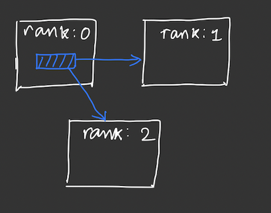 | 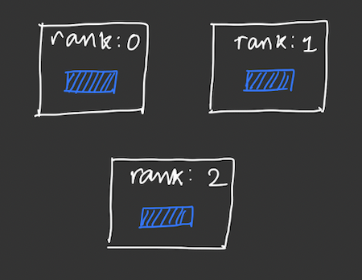 |


#### `scatter`

`scatter` accepts a `src` argument and a list of tensors to scatter. The source will scatter one tensor in the list to each of the other workers. Worker with rank `idx` will get the tensor at the `idx` index from the input list. The API also accepts an empty tensor for receiving the tensor. The sender will get its own tensor in this buffer after the API completes. The sender will be blocked until all the receivers have accepted this call.

| time = 0 | time = 1 |
| -------- | -------- |
| 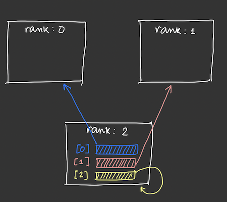 | 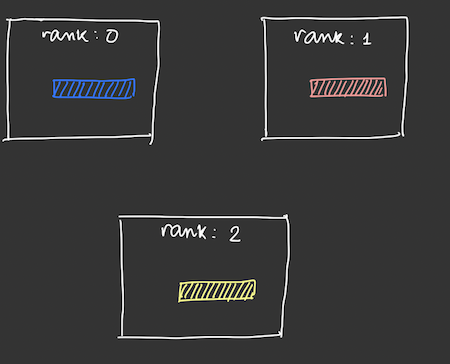 |


#### `gather`

`gather` is the inverse of `scatter`, it takes a tensor from all other workers and collects them in a list on the destination worker. Therefore it accepts a `dst` argument. Tensor from worker with rank `idx` will show up as list item with index `idx` on the destination. The receiver will be blocked untill all senders have sent their tensors.

| time = 0 | time = 1 |
| -------- | -------- |
| 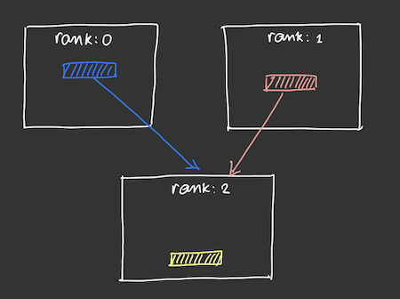 | 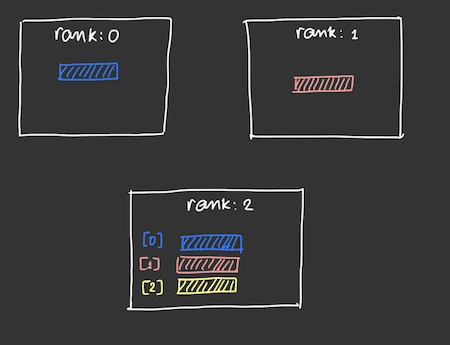 |


#### `reduce`

`reduce` builds on top of `gather`. All the tensors that are gathered in the destination are reduced via some elementwise operator, e.g., addition. 

| time = 0     | time = 1     |
| ------------ | ------------ |
| 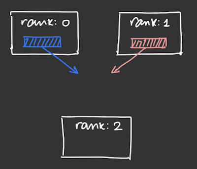 | 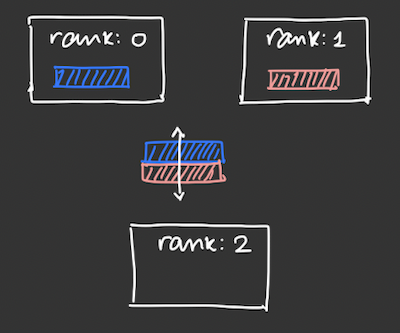 |
| **time = 2** | **time = 3** |
| 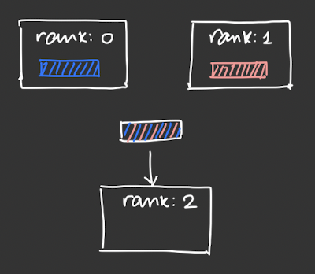 | 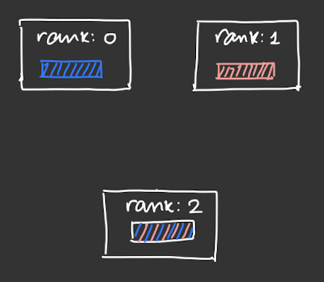 |

`reduce` family of APIs only supports the following ops -

* `SUM` and `PRODUCT`
* `MIN` and `MAX`
* `BAND`, `BOR`, and `BXOR`

`SUM` and `PRODUCT` is an **elementwise sum and product of a bunch of vectors**. This is contrary to my initial understanding that it “reduces” a vector into a scalar. This means that all the vectors on all the different devices have to be of the same size. e.g.,

```python
v2 = np.array([0.1555, 0.0430, 0.1068, 0.1119, 0.8360])
v1 = np.array([0.6234, 0.0273, 0.4684, 0.4909, 0.4108])
ans = [i + j for i, j in zip(v1, v2)]
[0.7789, 0.0703, 0.5752, 0.6028, 1.2468]
```

Along similar lines - `MAX` and `MIN` are the **element wise max and min of a bunch of vectors**. Again this was contrary to my initial understanding, and again all the vectors need to be of the same size.

```python
v1 = np.array([0.4078, 0.0942, 0.9531, 0.5698, 0.6598])
v2 = np.array([0.5521, 0.6341, 0.7305, 0.9835, 0.7748])
ans = [max(i, j) for i, j in zip(v1, v2)]
[0.5521, 0.6341, 0.9531, 0.9835, 0.7748]
```


#### `reduce_scatter`

This is not supported by the `GLOO` backend. This is a weird one and I have not fully figured out how it works in PyTorch. In the MPI world, each worker will contribute one tensor, all these tensors will be (element-wise) reduced and the reduced tensor will be chopped up into as many chunks as the number of workers. Each worker then gets back one chunk of the chopped up reduced tensor. The PyTorch API does not match with this as it requires an `input_list`.


#### `all_gather`

Similar to `gather`. In `gather` the final gathered list of tensors ended up on the destination worker. In `all_gather` all the workers will have the gathered list of tensors. As such there is no concept of source or destination.

| time = 0     | time = 1 |
| ------------ | -------- |
| 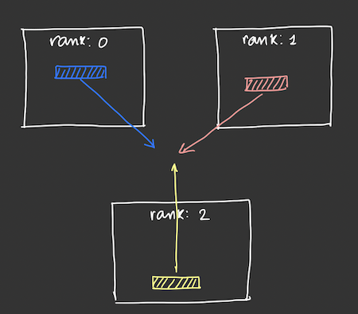 | 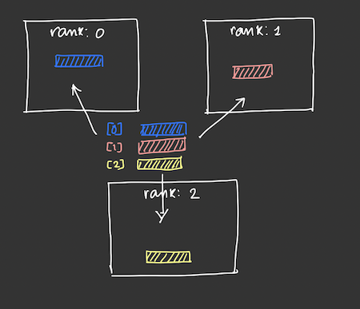 |
| **time = 2** |          |
| 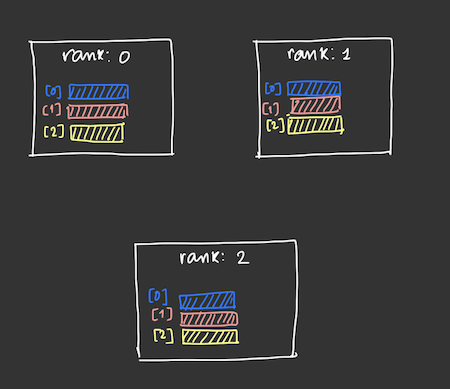 | |


#### `all_reduce`

Similar to `reduce`, except the reduced tensor will be available on all the workers. As such there is no concept of a source or destination.

| time = 0     | time = 1     |
| ------------ | ------------ |
| 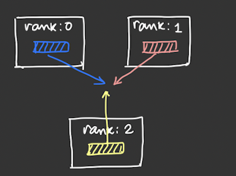 | 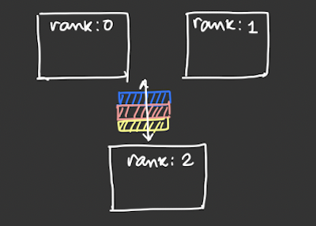 |
| **time = 2** | **time = 3** |
| 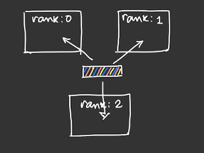 | 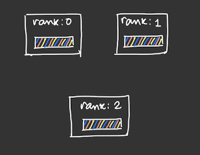 |


#### `all_to_all`

This is not available on the `GLOO` backend. Each worker scatters a list of tensors and all the workers gathers this scattered list. As a result all the workers will get a new list of tensors.

| time = 0 | time = 1 |
| -------- | -------- |
| 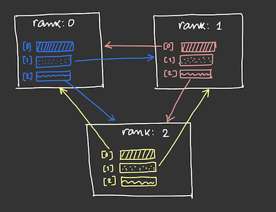 | 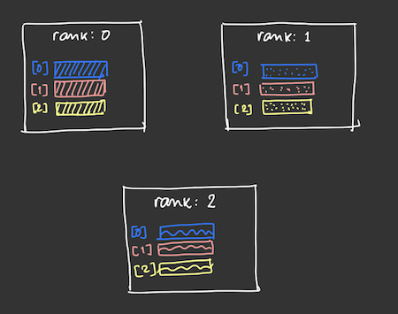 |


#### `multigpu`

`multigpu` family of ops only seem to make sense when a process spans multiple GPUs. The [documentation](https://pytorch.org/docs/stable/distributed.html#multi-gpu-collective-functions) says that if I have a process of rank:0 running on one node and another process of rank:1 running on **another node**, then if rank:0 has tensors on multiple GPUs of its node and rank:1 has tensors on multiple GPU of its node, then the `multigpu` family of APIs will help with reducing all of these tensors. So far I have not played around with multi-host configuration.

## DDP Training

In order to actually use DDP for training, I have to start multiple processes and give them each their rank and the location of the master. Apart from that I don't have to deal with these low level communication functions. All I have to do is to wrap the `torch.nn.Module` model object in `torch.nn.parallel.DistributedDataParallel` object. Then I train each trainer/master as usual, the underlying gradient comms are taken care of by DDP. See `ex4` for a worked out example.

> When wrapping a model in `DDP`, remember to set the `device_ids` and the `output_device` to the current GPU device, otherwise these default to 0 which will cause all the trainer processes to run on GPU:0 resulting in deadlocks.

## Checkpointing
Use cases for checkpointing -
  * Prevent overfitting
  * Model publishing
  * Transfer learning
  * Failure recovery

### Prevent Overfitting
In this scenario we checkpoint the model at successive time intervals while the training is progressing. After the training completes we can choose the checkpoint with the best validation score, which is not neccessarily the last checkpoint if the model has overfitted. This lets us get rid of the overfitting steps. All we need to checkpoint are the model params.

### Model Publishing
Once the training completes, we need to publish the model for inference. The best checkpoint can be used for this. Here too all we need to checkpoint are the model params.

### Transfer Learning
When fine tuning a model, we often want to take a previously trained model, or this same model's old weights and then train on new data that could be more specific. E.g., a general computer vision model can be used to train a self driving car perception model by fine tuning an existing CV model or by using the intermediate features of the CV model as input to the specialized model. Checkpoints provide an easy way to load the state of such previously trained models. Here, in addition to the model params, we might also need to checkpoint the hyperparams.

### Failure Recovery
In a long distributed training job, it is possible for the training run to be pre-empted because of node failures, maintenance, arrival of some other high-priority job, etc. In this case, we want to restart the training from where we left off. Here in addition to the model params, we also need to checkpoint the optimizer and the data loader. The optimizer checkpoint is needed because in most cases we use some sort of a learning rate scheduler which varies the learning rate as the training progresses. When we resume the training we don't want to reset the lr to its initial value. We want it to start from where it left off. Data loader checkpointing is needed for a similar reason. If we restart our training from the first data loader, then there is a danger of overfitting the model on some training instances that are seen more than planned for.

## Params accepted by AWS SM Estimator

The `sagemaker.pytorch.estimator.PyTorch` build and launches a container to run distributed training. This estimator takes in the following parameters:

#### Job Config

* enable_network_isolation: self explanatory.
* instance_count: Total number of instances.
* instance_type: The instance type to use. I guess this means that all the instances can be of the same type.
* max_run: The training job will be killed after this much time regardless of whether it has completed or not.

#### Container Config

* entry_point: Python module with a `main` entrypoint.
* framework_version: Desired PyTorch version.
* py_version: One of `py2` or `py3`.
* source_dir: `file://` or `s3://` of the path that has deps needed by the entry point Python module.
* image_uri: The base Docker image to be used. By default AWS will use their own "official" container.
* dependencies: List of paths to directories that need to be exported to the container.
* git_config: Didn't quite understand how this is used. I guess if the code is to be cloned from git at runtime inside the container, this will be used.
* volume_size: Not sure if this is the size of volume attached to each instance or the total volume size across all instances.

#### App Config

* container_log_level: This is the log level of the trainer running inside the container.
* code_location: The S3 prefix where custom code will be uploaded. It is not clear who will upload this code and for what.
* checkpoint_s3_uri: SM will periodically upload the checkpoint saved on the local path upto this S3 location. At startup, it will first try to download the contents from this URI to the local path so the container can decide to resume its training.
* checkpoint_local_path: The local path where the checkpoints are saved as a waypoint to S3. Defaults to `/opt/ml/checkpoints/`.
* enable_sagemaker_metrics: -
* role: the AWS IAM role that will run this training.
* volume_kms_key: KMS key to encrypt volume.
* input_mode: By default SM will copy the input data from S3 to a local directory. The mode is `File` for this. It can also stream data directly from S3 to the container over Unix named pipes. The mode is `Pipe`.
* output_path: S3 location for training output artifacts. The documentation says something about using `file://`urls for local mode, but don't quite understand how this plays with the other options.

#### Model Config

* hyperparameters: A `Dict[str, str]` that is available in the container by calling the `sagemaker.pytorch.estimator.PyTorch.hyperparameters()` method.

#### Trainer Config

* distribution: This is the distributed training config. It can be one of the following `dict`s.:

  To use a centralized parameter server:

  ```
  {
    "parameter_server": {
      "enabled": True
    }
  }
  ```

  To use MPI based DDP

  ```
  {
    "mpi": {
      "enabled": True
    }
  }
  ```

  To use DDP or MP

  ```
  {
    "smdistributed": {
      "dataparallel": {
        "enabled": True
      },
      "modelparallel": {
        "enabled": True,
        "parameters": {}
      }
    }
  }
  ```

